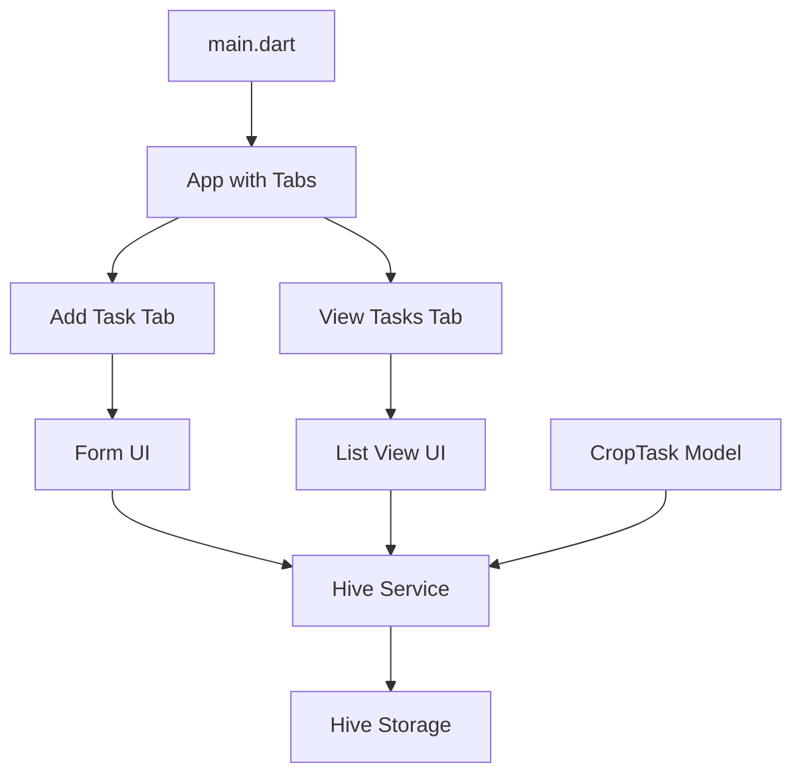
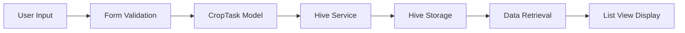

# Crop Task Tracking App - Implementation Plan

## Data Model and Storage

### 1. Add Hive Dependencies

We need to add the following packages to the `pubspec.yaml` file:
- `hive`: For local database storage
- `hive_flutter`: Flutter extensions for Hive
- `path_provider`: To get the application documents directory for Hive storage
- `intl`: For date formatting

### 2. Create a Data Model for Crop Tasks

We'll create a `CropTask` model class with the following properties:
- `id`: Unique identifier for each task
- `cropName`: Name of the crop
- `taskDescription`: Description of the task to be performed
- `date`: Date when the task should be performed

This model will be annotated with Hive annotations to make it compatible with Hive storage.

### 3. Configure Hive and Register Adapters

We need to:
- Initialize Hive in the `main.dart` file
- Register the `CropTask` adapter for Hive to serialize/deserialize the model
- Open the Hive box that will store the crop tasks

### 4. Create a Service for Hive Data Operations

We'll create a service class that will handle all Hive operations:
- Adding new crop tasks
- Retrieving all saved tasks
- Updating existing tasks
- Deleting tasks

## UI Implementation

### 5. Update the Main App Theme and Title

We'll update the app title to "AgroFlow" and customize the theme with agriculture-related colors (greens and browns).

### 6. Create a Tabbed Interface

We'll implement a bottom navigation bar with two tabs:
- "Add Task" tab
- "View Tasks" tab

### 7. Implement the Form UI (Tab 1)

The form will include:
- A text field for crop name
- A text field for task description
- A date picker for selecting the task date
- A save button to store the data

### 8. Implement the List View UI (Tab 2)

The list view will:
- Display all saved crop tasks
- Show the crop name, task description, and date for each task
- Sort tasks by date (upcoming tasks first)
- Include a visual indicator for tasks due soon

### 9. Add Form Validation and Error Handling

We'll implement validation to ensure:
- Crop name is not empty
- Task description is not empty
- Date is selected
- Show appropriate error messages for invalid inputs

### 10-11. Implement Save and Retrieval Functionality

We'll connect the UI with the Hive service to:
- Save new tasks when the form is submitted
- Load and display all tasks in the list view
- Refresh the list view when new tasks are added

## Architecture Diagram



## Data Flow Diagram



## File Structure

```
lib/
├── main.dart                  # App entry point, Hive initialization
├── models/
│   └── crop_task.dart         # CropTask model with Hive annotations
├── services/
│   └── hive_service.dart      # Service for Hive operations
└── screens/
    ├── home_screen.dart       # Main screen with tabs
    ├── add_task_screen.dart   # Form for adding tasks
    └── view_tasks_screen.dart # List view for displaying tasks